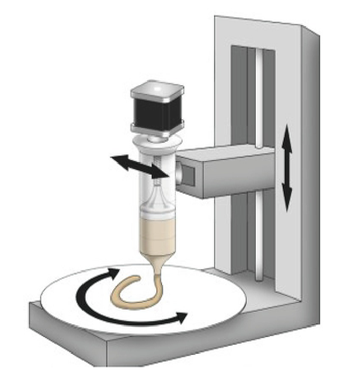
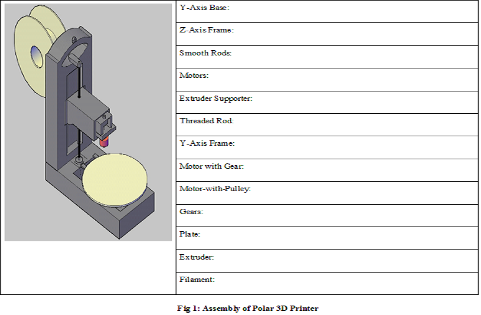
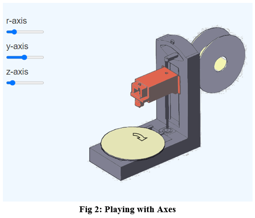

# Ex. No.4 SIMULATION OF POLAR 3D PRINTER MACHINE

### DATE: 19-05-2023

## AIM:
### To simulate the construction of polar 3D printer and to get in-depth knowledge of mechatronics of polar 3D printers.

## REQUIREMENTS:
### ●	System - Windows 7 or higher, 1 GB RAM.

## PROCEDURE:

## Assembly of Polar 3D Printer
### 1.	Select 'Assembly of Polar 3D Printer' from the visible list.
### 2.	All the parts related to Polar 3D Printer will be shown on the screen.
### 3.	Select the parts in sequence in which they are shown.
### 4.	When the first part is selected then it will open in the blank space in the left side of the screen.
### 5.	Further, when the correct part will be selected then it will get assembled with the previously selected part/parts.
### 6.	If the user follows an incorrect sequence then a pop-up will appear on the screen showing the name of the part to be selected.

## Playing with Axes
### 1.	Move the r-axis slider and observe the movement of the r-axis assembly.
### 2.	Move the y-axis slider and observe the movement of the y-axis assembly.
### 3.	Move the z-axis slider and observe the movement of the z-axis assembly.

## OUTPUT:

#### Y-AXIS BASE :
The base of the printer that supports the rest of the components.
#### Z-AXIS FRAME :
This is the frame that holds the print head and moves it up and down along the vertical axis.
#### SMOOTH RODS :
The smooth rods that provide smooth and accurate movement of the Z-axis frame.
#### MOTORS :
Provide the power to move the Z-axis frame and the print head.
#### EXTRUDER SUPPORTER :
The support structure that holds the extruder assembly.
#### THREADED ROD :
Threaded rod that provides the power to move the Z-axis frame up and down.
#### Y-AXIS FRAME :
The frame that moves the print head in the horizontal plane.
#### MOTOR WITH GEAR :
Provides the power to move the Y-axis frame.
#### MOTOR-WITH-PULLEY :
Provides the power to move the Z-axis frame.
#### GEARS :
Transfer power from the stepper motors to the threaded rod and the smooth rods.
#### PLATE :
Plate where the printed object is created.
#### EXTRUDER :
Melts and extrudes the filament to create the printed object.
#### FILAMENT :
Material that is used to create the printed object.

## Output:

### Name: SATHISH R
### Register Number: 212222100048

## Result: 
### Thus the simulation on construction of polar 3D printer is completed & movement of axis along X, Y, & Z has been studied.
